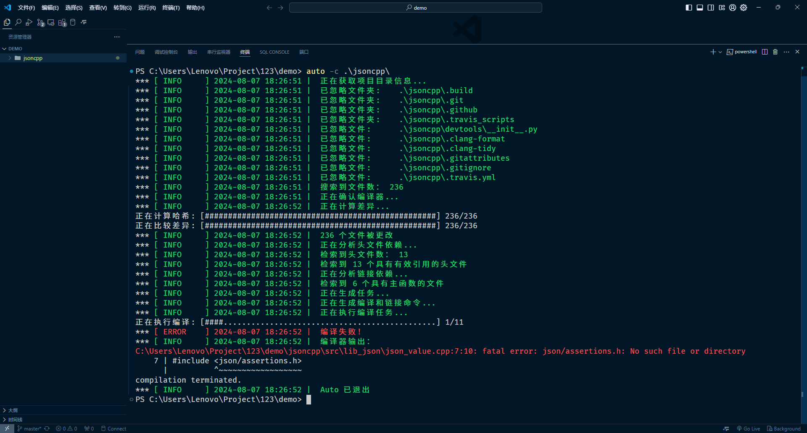
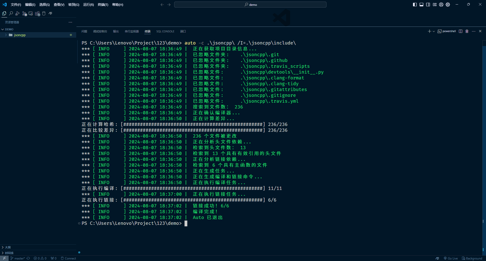
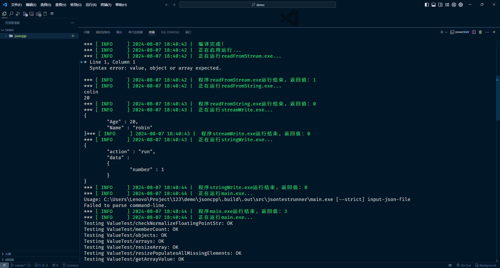
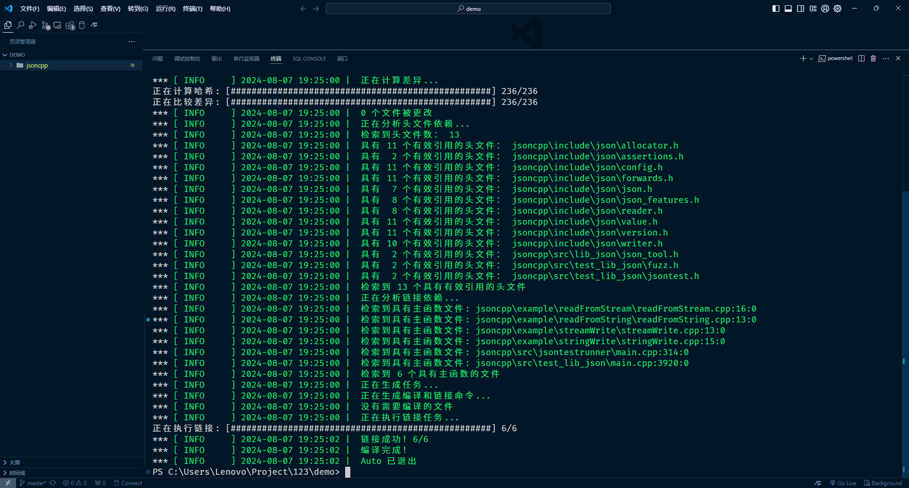
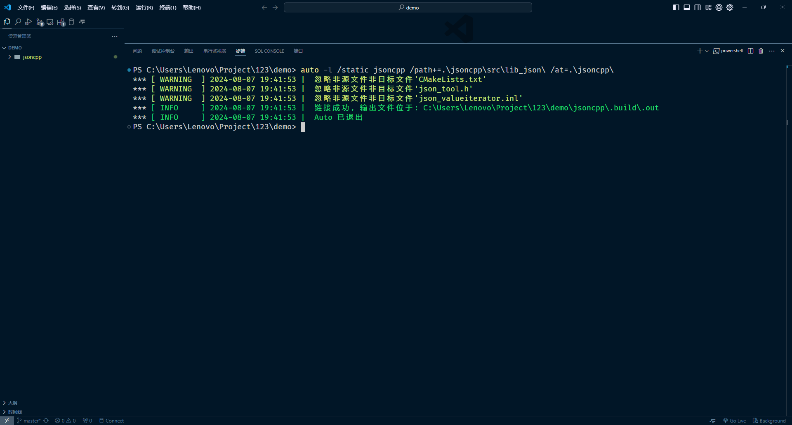
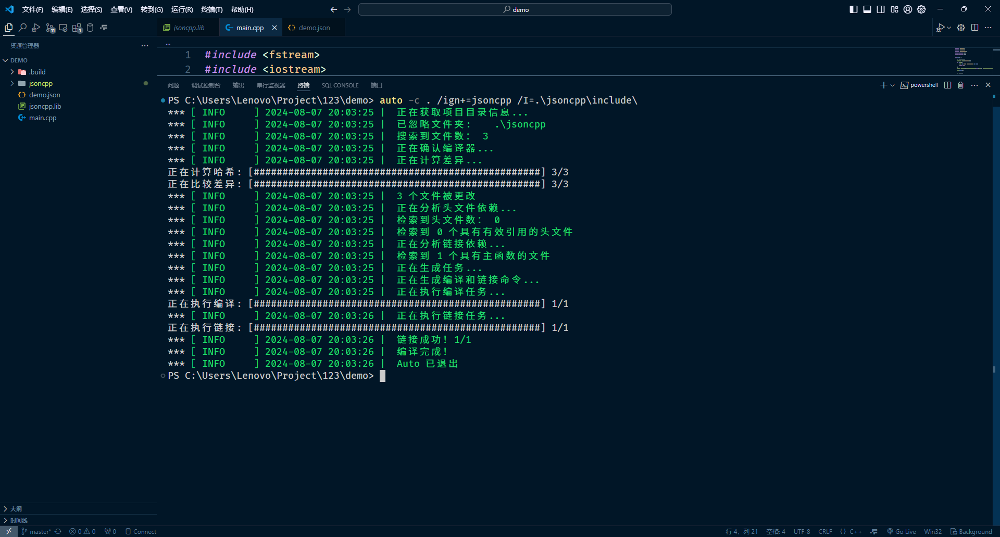
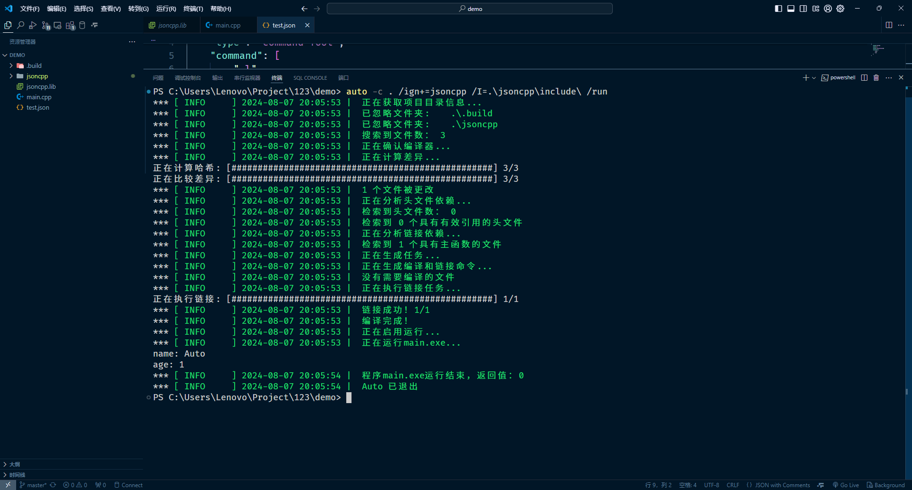

# auto 使用示例

我将以开源项目 [JsonCpp](https://github.com/open-source-parsers/jsoncpp.git) 的编译与使用演示 auto 的使用方法。

## 获取 JsonCpp
首先，通过 Git 克隆项目到本地：
```shell
git clone https://github.com/open-source-parsers/jsoncpp.git
```

## 编译 JsonCpp
然后通过 auto 命令编译 JsonCpp：
```shell
auto -c jsoncpp
```
输出如下：

通过输出，可以很明显地看到一条注红的编译报错信息：
```shell
C:\Users\Lenovo\Project\123\demo\jsoncpp\src\lib_json\json_value.cpp:7:10: fatal error: json/assertions.h: No such file or directory
    7 | #include <json/assertions.h>
      |          ^~~~~~~~~~~~~~~~~~~
compilation terminated.
```
它是编译器的输出，提示找不到 `json/assertions.h` 文件，这是因为 auto 只会分析出头文件的一级父目录，并不会分析到 `json` 目录，因而编译器也就无法找到该头文件，解决方法是通过 auto 的 `/I=` 参数额外指定 auto 无法搜索到的目录：
```shell
auto -c .\jsoncpp\ /I=.\jsoncpp\include\
```
输出如下：

> 自 v0.2 起，添加了父目录搜索级数 `/I:` 参数，它的默认值为 2 (`/I:2`)，即将头文件所在文件夹和该文件夹的父文件夹都加入搜索路径，这可以适用于大多数情况
通过输出，可以看到项目有11个源文件，执行了6个链接任务。这6个链接任务便是 JsonCpp 中的示例程序，可以通过在编译时指定 `/run` 参数使 auto 运行示例程序，但无法向程序传递命令行参数：
```shell
auto -c .\jsoncpp\ /I=.\jsoncpp\include\ /run
```
部分输出如下：


## 生成链接库
JsonCpp 并不是一个十分复杂的项目，因此可以很容易看出要链接哪些源文件。你可以通过在编译时指定 `/all` 参数来查看更详细的项目分析信息：
```shell
auto -c .\jsoncpp\ /I=.\jsoncpp\include\ /all
```
输出如下：

通过它你可以查看到项目下有哪些头文件，它们被多少个源文件直接或间接引用以及哪些源文件可以作为具有main函数的程序入口点。

> 注：main函数入口的识别是通过行首标记序列 `int main(` 和 `void main(` 来判断的，如果你的项目中的入口函数不是这两种形式，则需要在文件中添加注释 `// main` 用来标记该文件可以作为程序入口，它必须位于行首并且要包含其中的空格。

通过 auto 的 `/l` 参数，可以使得 auto 生成静态或动态链接库。以 JsonCpp 为例，它可以用于生成静态链接库，通过查看它的项目目录可以发现，它的核心是 `jsoncpp\src\lib_json` 下的源文件，由于当前的目录不是 JsonCpp 的项目目录，因此就还需要通过 `/at=` 参数手动指定项目目录，于是通过如下命令就可以链接出静态库：
```shell
auto -l /static jsoncpp /path+=.\jsoncpp\src\lib_json\ /at=.\jsoncpp\
```
输出如下：

通过输出，可以看到 auto 成功生成了静态链接库 `jsoncpp.lib`，它位于 `jsoncpp\.build\.out` 目录下。

**到此为止，已经成功地创建了静态链接库jsoncpp.lib，现在通过它来应用到自己的程序中**

## 编写程序

先来写一个简单的 json 文件：
```json
{
    "name": "Auto",
    "age": 1,
    "type": "command-Tool",
    "command": [
        "-l",
        "-c"
    ]
}
```

然后编写一个程序来解析这个 json 文件，例如我要获取它的name和age字段：
```c++
#include <fstream>
#include <iostream>
#include <json/json.h>
using namespace std;
using namespace Json;

int main() {
    // 读取json文件
    ifstream ifs("test.json");
    if (!ifs) {
        cout << "open file failed." << endl;
        return -1;
    }
    string content((istreambuf_iterator<char>(ifs)), (istreambuf_iterator<char>()));
    ifs.close();

    // 解析json
    Value root;
    if (!Reader().parse(content, root)) {
        cout << "parse json failed." << endl;
        return -1;
    }

    // 获取name和age字段
    string name = root["name"].asString();
    int age = root["age"].asInt();

    // 输出结果
    cout << "name: " << name << endl;
    cout << "age: " << age << endl;

    return 0;
}
```

## 编译程序

然后通过 auto 编译这个程序，但我们已经不再需要分析 jsoncpp 目录了，便可以用过 `/ign+=` 参数忽略掉它，auto 还提供了 `/ign=` 参数，它会覆盖掉默认值，但我们忽略了 jsoncpp 目录，这意味着 jsoncpp 的相关头文件也无法被分析到，解决方案有两种，一种方式是头文件目录复制过来，也是最直接的办法，另一种是给通过 `/I=` 参数指定，这里我选择第二种，同样的，链接库也面临同样的问题，这里我选择前者，直接将链接库放到根目录下：
```shell
auto -c . /ign+=jsoncpp /I=.\jsoncpp\include\
```
此外 `/ign+=` 和 `/ign=` 参数指定的忽略都是按名称筛选的，因此你不能将它指定为某个路径

输出如下：

通过输出，可以看到 auto 成功编译了程序，它自动地链接了 jsoncpp.lib 库，并生成了可执行文件 `main.exe`。
我们也可以通过在编译时指定 `/run` 参数使得编译结束后自动运行程序：
```shell
auto -c . /ign+=jsoncpp /I=.\jsoncpp\include\ /run
```
输出如下：

可以看到程序输出如下：
```
name: Auto
age: 1
```

## 结尾

auto 更多的使用方法可以通过命令 `auto -h` 查看
